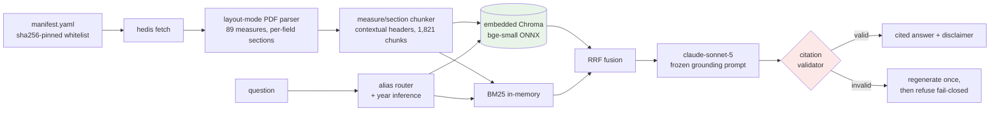

# hedis-spec-copilot

A RAG copilot that answers eligibility, exclusion, coding, threshold, and timeline questions
about **Medicare Star Ratings / HEDIS-aligned measures** — with every factual sentence cited
back to a real passage from an **exclusively public corpus**, and an eval harness whose
numbers are generated from committed artifacts, never hand-typed.

[](https://github.com/thiagobandeira1/hedis-spec-copilot/actions/workflows/ci.yml)


Part of a 7-repo value-based-care AI portfolio — the measure-knowledge companion to
[fhir-feature-service](https://github.com/thiagobandeira1/fhir-feature-service).

## How it works



Everything before the LLM is deterministic and keyless; the chat model is injected as a
`BaseChatModel`, so CI runs the identical pipeline under a fake model with **zero secrets**.

## Quickstart (<10 min; keyless mode works)

```bash
uv sync --group dev
uv run hedis build --source corpus/committed   # offline: committed corpus -> local index (~5 min CPU)
uv run hedis ask "Who is excluded from the colorectal cancer screening measure?"
```

Without an API key, `ask` (and the UI) run in **retrieval-only mode**: ranked passages with
full citation cards — the retrieval engineering is experienceable at zero cost. For generated
answers, copy `.env.example` to `.env` and set `HEDIS_ANTHROPIC_API_KEY`.

```bash
uv run streamlit run app/streamlit_app.py
```

## Eval results

Retrieval metrics are **recomputed live in CI** on every push (keyless, hermetic) and gated
against a committed, measured baseline (−0.02 ratchet on recall@8 / MRR). LLM faithfulness
runs locally (`hedis eval --full`) and lands as stamped artifacts in `evals/results/`.

<!-- EVAL:BEGIN -->
| Metric (test split) | Hybrid | Dense-only |
|---|---|---|
| hit@1 | 0.500 | 0.528 |
| mrr | 0.613 | 0.649 |
| precision@8 | 0.260 | 0.247 |
| recall@5 | 0.498 | 0.550 |
| recall@8 | 0.646 | 0.621 |

_Stamps: config_hash=05d482f586746260 · dataset_hash=0ee214006f191ae2_
<!-- EVAL:END -->

The 60-item gold set (48 answerable across 6 categories + 12 refusal traps, 15 dev / 45
test) was authored doc-first against the committed corpus with a documented protocol
(`evals/README.md`); labels are (doc, measure, section)-granular so they survive chunker
refactors.

**Findings worth reading** (each measured, then fixed or documented):

- **Year conflation was the dominant retrieval failure** — unqualified queries mixed
  2025/2026 chunks. Deterministic plan-year inference plus an adversarial-review parser fix
  (wrapped TOC entries had created phantom measure blocks that poisoned the index) moved
  all-items hit@1 across the tuning cycle from 0.19 → 0.42 → 0.50.
- **The hybrid delta is mixed, not a slogan**: on the test split, dense-only edges hybrid on
  MRR (0.649 vs 0.613) while hybrid wins recall@8 (0.646 vs 0.621). Both columns are
  published; the `Reranker` seam exists for whatever the numbers justify next.
- **Refusal traps cannot be separated in embedding space** (both classes land 0.64–0.79
  best-cosine on bge-small — plausible questions are plausible), so pre-LLM refusal is a
  degenerate-query guard only: [ADR-007](docs/adr/007-gate-a-degenerate-guard-only.md).

## The corpus is public — by construction

| Tier | Content | Policy |
|---|---|---|
| **A (committed)** | CMS 2025/2026 Star Ratings Technical Notes, 2027 measure list, 2026 fact sheet — US-gov public domain (17 U.S.C. §105) | Normalized text committed; raw PDFs sha256-pinned, fetched to a gitignored cache |
| **B (fetch-at-build)** | NCQA public summary pages (©NCQA) | Never committed; ≤75-word excerpts, amber-badged in the UI, cited by URL |

- NCQA's licensed HEDIS Technical Specifications are **never** vendored, scraped, or
  reproduced. Questions that require them (exhaustive exclusion sets, full value-set code
  lists) get an explicit refusal pointing to NCQA licensing — tested behavior, not a hope.
- pytest **license gates** fail the build if a non-committable file is ever git-tracked.
- Every chunk carries provenance (source URL, retrieval date, license posture, page), and
  every citation card shows it.
- No patient data of any kind exists in this project.

**Disclaimer:** answers summarize public CMS/NCQA-published documents. This is not the NCQA
HEDIS technical specification, and not clinical, coding, or billing advice. HEDIS® is a
registered trademark of NCQA; this project is not affiliated with NCQA or CMS.

## Engineering notes

- **Fail-closed citations** — a hallucinated citation marker triggers one corrected
  regeneration, then an honest refusal; no uncited answer ever renders (proven in CI with a
  scripted misbehaving fake model).
- **Hybrid retrieval, measured** — dense (bge-small, query-prefix asymmetry) + BM25 fused
  with RRF; the alias router derives measure ids from the corpus itself, never a
  hand-maintained table; year inference prevents 2025/2026 conflation.
- **Two-tier eval discipline** — CI: keyless retrieval metrics + ratchet gate + license
  gates + fake-LLM end-to-end paths. Local: LLM-judge faithfulness (claude-opus-5 judging
  claude-sonnet-5 — a stronger, different model to blunt self-preference) with a human
  spot-check protocol.
- **Deny-by-default hygiene** — RFC-9457-style honest errors, SecretStr keys, `.env` only,
  no repository secrets at all.
- Quality bar: **~190 tests**, mypy `--strict`, ruff, ADRs 001–007, conventional commits.

## Limitations (honest)

- The corpus is measure *descriptions* (Technical Notes), not the full specifications —
  answers are demo-grade guidance, bounded by what CMS publishes publicly.
- `timelines`/`coding` categories retrieve weakest (small, near-duplicate sections);
  the eval table shows per-category numbers rather than hiding them in an average.
- Faithfulness numbers require a local run with an API key; the README table marks their
  status explicitly.
- Single-user, localhost design; the index rebuilds from source rather than shipping.

## Repository map

`src/hedis_copilot/` — `corpus/` (manifest → fetch → parse → chunk) · `index/` (FastEmbed,
Chroma, BM25) · `retrieval/` (aliases, hybrid, RRF) · `answer/` (prompts, citations, chain,
service) · `evals/` (dataset, metrics, judge, runner, report) · `cli.py` · `app/streamlit_app.py`
· `docs/SPEC.md` · `docs/adr/` · `evals/dataset/questions.jsonl` + `evals/baseline.json`.

MIT licensed.
